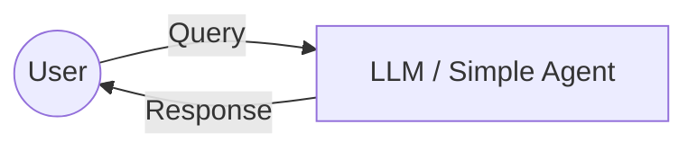
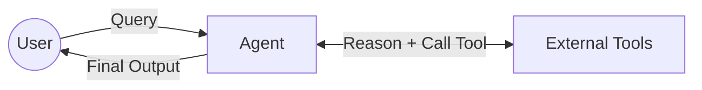
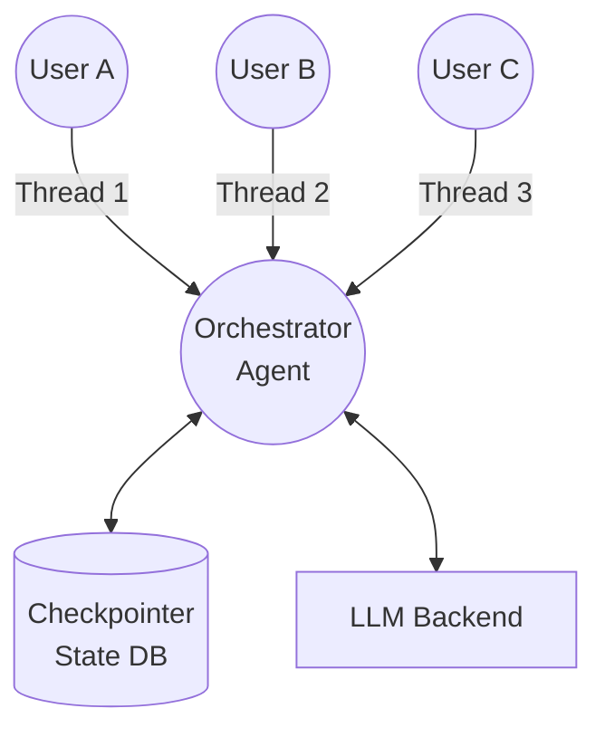

# Stateful Agents: From Simple AI to Parallel State Management

---

## 1. Simple AI Agents

A **Simple AI Agent** is a stateless wrapper around a Large Language Model (LLM). Every interaction is isolated. The LLM has no concept of "tools" to fetch external data, nor does it remember past interactions unless you manually pass the context every time.

### Architecture


### Practical Code Snippet
```python
from langchain_openai import ChatOpenAI
from langchain_core.messages import HumanMessage

# Initialize a simple AI agent. It can answer questions but cannot take actions.
llm = ChatOpenAI(model="gpt-4o", temperature=0)

# Send a single, stateless request
response = llm.invoke([
    HumanMessage(content="What is the capital of France?")
])

print("AI Output:", response.content)
```

### Sample Run Output
```text
AI Output: The capital of France is Paris.
```

---

## 2. Agentic AI

**Agentic AI** equips the simple AI with **Tools** and an **Execution Loop** (e.g., ReAct). The agent can now reason about a problem, independently execute a tool (like searching a database or an API), observe the tool's result, and formulate a final answer. 

### Architecture


### Practical Code Snippet
```python
from langgraph.prebuilt import create_react_agent
from langchain_openai import ChatOpenAI
from langchain_core.tools import tool

# 1. Provide tools the agent can use to interact with the world
@tool
def get_weather(location: str) -> str:
    """Get the current weather for a location."""
    return f"The weather in {location} is 75°F and sunny."

llm = ChatOpenAI(model="gpt-4o", temperature=0)
tools = [get_weather]

# 2. Wrap the LLM with a reasoning loop
agent = create_react_agent(llm, tools)

# 3. Ask a question that requires tool use
result = agent.invoke({
    "messages": [("user", "What's the weather like in Seattle?")]
})

for msg in result["messages"]:
    msg.pretty_print()
```

### Sample Run Output
```text
================================ Human Message =================================
What's the weather like in Seattle?
================================== Ai Message ==================================
Tool Calls:
  get_weather (call_xyz123)
  Call ID: call_xyz123
  Args:
    location: Seattle
================================= Tool Message =================================
Name: get_weather
The weather in Seattle is 75°F and sunny.
================================== Ai Message ==================================
The weather in Seattle is currently 75°F and sunny.
```

---

## 3. Stateful Agents: The Need for Memory in Parallel Execution

When scaling Agentic AI, you will invariably run multiple agents—or serve multiple users—in **parallel**. If you rely on basic global variables or list-appending to track conversations, you will encounter race conditions and crossed data.

To solve this, we inject a **Checkpointer (Memory)** that associates the agent graph's *State* with a unique `thread_id`. The agent queries the state database before running, loads only the context for that thread, acts, and checkpoints the updated state back. 

### Architecture


### Practical Code Snippet
```python
from langgraph.prebuilt import create_react_agent
from langgraph.checkpoint.memory import MemorySaver
from langchain_openai import ChatOpenAI

llm = ChatOpenAI(model="gpt-4o")

# 1. Initialize isolated memory checkpointer
memory = MemorySaver()

# 2. Create the agent backed by memory
agent = create_react_agent(llm, tools=[], checkpointer=memory)

# 3. Define the thread (execution context) to ensure data isolation
config = {"configurable": {"thread_id": "user_alice_session_1"}}

print("--- Thread 1: First Request ---")
result1 = agent.invoke(
    {"messages": [("user", "Hi, I am Alice and my favorite color is Blue.")]},
    config=config
)
print(result1["messages"][-1].content)

# In parallel, a totally different threat could be running...

print("\n--- Thread 1: Second Request (Leveraging Memory) ---")
# The agent automatically pulls historical messages from "user_alice_session_1"
result2 = agent.invoke(
    {"messages": [("user", "What is my name and favorite color?")]},
    config=config
)
print(result2["messages"][-1].content)
```

### Sample Run Output
```text
--- Thread 1: First Request ---
Hello Alice! It's great to meet you.

--- Thread 1: Second Request (Leveraging Memory) ---
Your name is Alice, and your favorite color is Blue!
```

---

## 4. Common Agentic Patterns

As the complexity of AI applications grows, several architectural patterns govern agent behavior:

1. **ReAct (Reason + Act):** The standard loop where an agent thinks, takes a single action, observes the result, and loops until the answer is found.
2. **Plan and Execute:** A "planner" agent generates a multi-step checklist. "Worker" agents then execute those steps (often in parallel) and report back. 
3. **Supervisor (Hierarchical):** A top-level routing agent delegates tasks down to specialized sub-agents (e.g., Code Writer Agent, DB Query Agent).
4. **Reflection (Critic Loop):** An agent drafts an output, then passes it to a "Critic" agent for review. If the critic finds faults, the generator tries again.

---

## 5. Cloud Deployment Best Practices (Azure)

Running stateful agents reliably in a production environment like Microsoft Azure requires migrating away from local memory to distributed cloud services. 

1. **Distributed Memory Backend:** 
   Local runtime memory (`MemorySaver`) vanishes when containers restart. Migrate your checkpointer to **Azure Cosmos DB** (via MongoDB vCore) to provide persistence for thousands of parallel `thread_ids` without race conditions.
2. **Caching for Speed and Cost:** 
   Wrap the agent state calls with **Azure Cache for Redis** to instantly retrieve frequent queries or recent threads, cutting latency and LLM token costs.
3. **Stateless Compute:** 
   Deploy your actual Python/LangGraph logic to **Azure Container Apps (ACA)** or **Azure Kubernetes Service (AKS)**. Because all memory lives in Cosmos/Redis, any pod can handle any `thread_id` scale seamlessly.
4. **Secrets Management:** 
   Store all OpenAI keys, MongoDB Strings, and Redis passwords securely inside **Azure Key Vault**. Use Azure Managed Identities so the code authenticates transparently.
5. **Observability and Tracing:** 
   Because agents run autonomous loops, traditional logging isn't enough. You must trace the agent's graph steps. Pipe your logs and LangChain callbacks directly to **Azure Monitor / App Insights** to see exactly which tools the agent called and why.

---
_End of Presentation Document_
